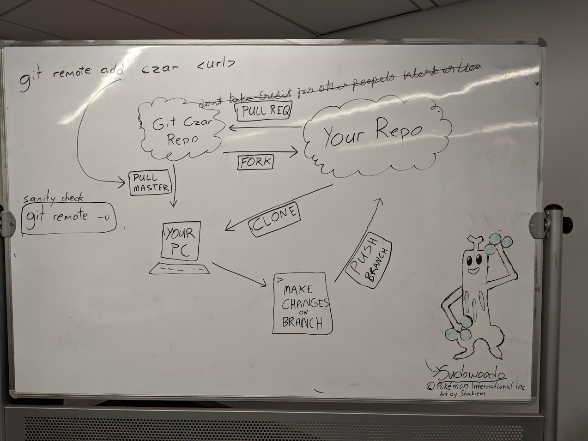

# Instructions

## Initial Setup

- Click `fork`
- Clone the copy of this repository from your github.
- Add this repository as the czar with `git remote add czar https://github.com/fizal619/yearup-class-2018.git`

## Doing a Workshop/Exercise

Please name your submission branches with the following format: `<week>_<day>_<type>`.

- Make sure you're on the `master` branch (`git checkout master`)
- Create a branch for your submission, e.g `git checkout -b w3_d1_morning_exercise`
- Create a folder to hold your files for each exercise:
  - For example: a morning exercise in day 1 of week 3: `w03/d01/morning_exercise`
- Add and commit your changes as you work
- Push to your branch e.g `git push origin w3_d1_morning_exercise`

## Submitting Your Work

Open a pull request to the czar's repository for your branch.

## After a Workshop/Exercise or Receiving Exercise from Instructor

- Switch back to your `master` branch.
- Update your local repository with `git pull czar master`
- Update your github account with `git push origin master`

_Rinse and Repeat_
