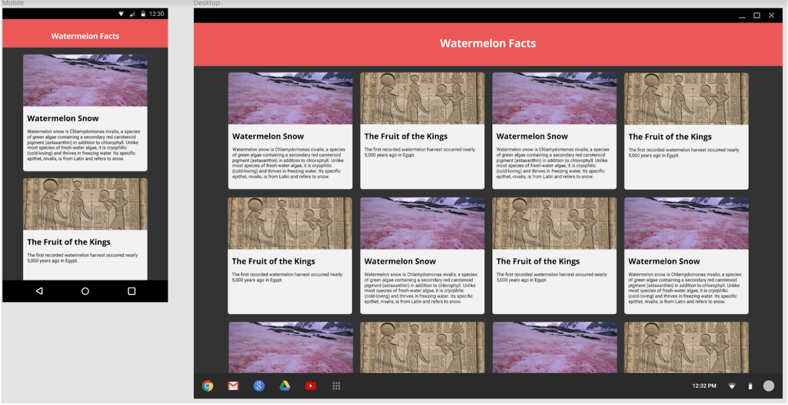

## Just Mockery
### Goal
To implement a web page off of a design mock.
### Learning Objectives
By the end of this exercise the student will be able to:
- implement a web page off of a design mock.
- follow a client's design direction.
- use a css framework to help make a page responsive.
### Introduction
Throughout your life as a developer you’ll find yourself working with mock ups more often than you’d think, especially when working alongside designers. For this workshop we’ll simulate a similar setting with the Watermelon Facts app Farmer Fred dreamed up.
He doesn’t need a working version with a server or anything, just a responsive webpage to show off the concept. He sent you the following mock-up to work with:

### Setup
- Go to your yearup-class-2018 folder
- Add and commit any work you might have, if you are not on the master branch.
- Make sure you switch to your master branch: `git checkout master`
- Pull from czar master: `git pull czar master`
- Make a branch for today's work: `git checkout -b w5_d2_workshop`
- For this exercise you should  definitely use a grid system to make things easier. (Bootstrap recommended, [however feel free to be adventurous and pick another if you'd like](https://github.com/troxler/awesome-css-frameworks))
- The font to be used is Open Sans and Roboto for the heading and body text respectively. https://fonts.google.com/?selection.family=Open+Sans|Roboto
- The background color is #303030    .
- The header background color is #EB5757     .
### Instructions
- Before beginning, consider your target devices. What breakpoints have we learned that can help with styling for both desktop and mobile?
- You should start implementing the desktop view first, then once you have that down add the media queries or classes to make the app accessible on mobile phones. Start by implementing the outer shell (header and background) of the app to get a feel of your chosen framework. Make sure the header is fixed and doesn’t scroll with the page.
- Next up implement the information cards - you can see these in the screenshots (they consist of a picture, a title and a body). These can be tricky to style. Remember they shouldn’t move around much when resized apart from moving from 4 column to single column. Be mindful of other screen sizes between Desktop and Mobile too!
- Now that you have the shell and the cards, you can add the inner content to the cards. At this point the finished product should look like the screenshot. Take the time to add more cards to fill the screen, it’s okay if they repeat.

### Resources
- [Bootstrap](https://getbootstrap.com/)
- [How to include google fonts in your web project](https://medium.freecodecamp.org/how-to-use-google-fonts-in-your-next-web-design-project-e1ad48f1adfa)

### Completion Requirements
- Complete Workshop by end of allotted time limit.
- The completed workshop:
  - has all the required style specifications (fonts and color).
  - is responsive.
  - utilizes a css grid framework.
  - has a fixed header.
- Group review session with the instructor.

### Submission

Please open a pull request against my repository after pushing to your branch on github.